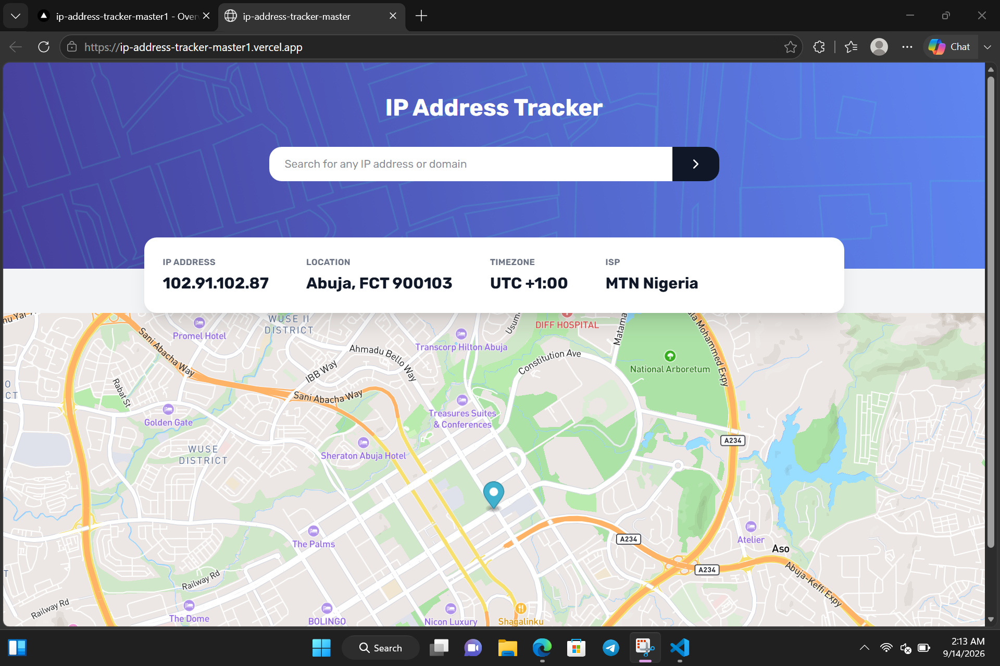

IP ADDRESS TRACKER MASTER : Freontend Mentor Task 

 

## Welcome! 👋

## The challenge

Your users should be able to:

- View the optimal layout for each page depending on their device's screen size
- See hover states for all interactive elements on the page
- See their own IP address on the map on the initial page load
- Search for any IP addresses or domains and see the key information and location

### Links

- Live Site URL: [Add live site URL here](https://ip-address-tracker-master1.vercel.app/)

### Built with

- Mobile-first workflow
- [React](https://reactjs.org/) - JS library
- [TailwindCss] - For styles
- [Vite] - Build Tool

### What I learned
I familiarized myself with the use of React ..

### AI Collaboration

- What tools did you use (e.g., ChatGPT, Claude, )
- How did you use them (used ChatGPT for the planning and in mapping out the whole process while Claude was used to create the boiler plates for the project )

## Author

- Frontend Mentor - [@bigmanik](https://www.frontendmentor.io/profile/bigmanik)
- Twitter - [@bigmanik_igb](https://www.twitter.com/bigmanik_igb)
